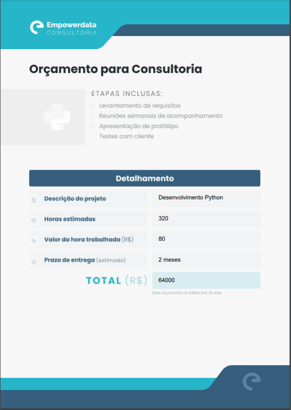

<!DOCTYPE html>
<html>
<head>
  <meta charset="UTF-8">
  <meta name="viewport" content="width=device-width, initial-scale=1.0">
</head>
<body>
  <h1>Gerador de PDF - Projeto com Jupyter Notebook</h1>

  
Este é um projeto em Python utilizando o Jupyter Notebook para captar as informações de um orçamento e gerar automaticamente um PDF.

  <h2>Objetivo</h2>

  
O objetivo deste projeto é criar um sistema simples para automatizar orçamentos e gerar um PDF para enviar para um cliente de forma rápida e precisa.

  <h2>Requisitos</h2>

  <ul>
    <li>Python 3.x</li>
    <li>Jupyter Notebook</li>
    <li>FPDF</li>
  </ul>

  <h2>Instalação das Dependências</h2>

  
Para executar este projeto, é necessário instalar as dependências listadas acima. Você pode instalá-las usando o gerenciador de pacotes <code>pip</code>. Abra o terminal e execute os seguintes comandos:

  <pre><code>pip install jupyter fpdf </code></pre>

  <h2>Instruções de Uso</h2>

  <ol>
    <li>Clone este repositório para o seu computador ou faça o download dos arquivos.</li>
    <li>Certifique-se de que o arquivo de template que utilizaremos(<code>template.png</code>) esteja na mesma pasta que este arquivo do Jupyter Notebook.</li>
    <li>Abra o Jupyter Notebook usando o comando <code>jupyter notebook</code> no terminal.</li>
    <li>Navegue até a pasta onde os arquivos do projeto estão localizados e abra o arquivo <code>OrçamentoSistemas.ipynb</code>.</li>
  </ol>

  <h2>Passos do Projeto</h2>

  
O projeto está estruturado da seguinte maneira no arquivo <code>OrçamentoSistemas.ipynb</code>:

  <ol>
    <li><strong>Execute a celula de Entrada de Dados:</strong> Após executar a célula digite as informações do seu orçamento.</li>
    <li><strong>Gerando o PDF:</strong> instale a biblioteca do fpdf, realize o import e execute a celula para criar um novo pdf</li>
  </ol>

   <h2>Orçamento PDF</h2>
    
   
  <h2>Resultados</h2>

  
Ao final do projeto você terá uma forma prática para automatizar seu sistema gerando um pdf de forma simples, gerando mais valor e uma experiência mais agradável para o seu cliente

  <h2>Conclusão</h2>

  
Este projeto demonstra como usar o Jupyter Notebook para otimizar o seu tempo. Você pode adaptar esses passos para evoluir ainda mais esse código e deixá-lo ainda mais dinâmico, agregando ainda mais para o seu negócio

</body>
</html>
